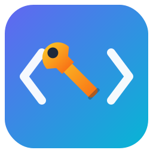
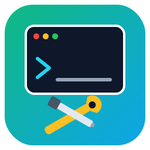

<!-- spec-header:v1 -->
<div align="center">


# Script 53 — Test Harness

**Part of the Dev Tools Setup Scripts toolkit**

[](https://github.com/alimtvnetwork/gitmap-v6#requirements)
[](https://github.com/alimtvnetwork/gitmap-v6#requirements)
[](https://github.com/alimtvnetwork/gitmap-v6/blob/main/scripts/registry.json)
[](https://github.com/alimtvnetwork/gitmap-v6/blob/main/LICENSE)
[](https://github.com/alimtvnetwork/gitmap-v6/blob/main/scripts/version.json)
[](https://github.com/alimtvnetwork/gitmap-v6/blob/main/changelog.md)
[](https://github.com/alimtvnetwork/gitmap-v6)

*Mandatory spec header — see [spec/00-spec-writing-guide](../../../spec/00-spec-writing-guide/readme.md).*

</div>

---

[](https://github.com/alimtvnetwork/gitmap-v6/actions/workflows/test-script-53.yml)

## Icon options

Three concept icons live in [`../assets/`](../assets/). Pick the one you want
as the canonical project icon and update the `` reference at the top of
this file (and any other surfaces) accordingly.

| v1 -- Wrench + Brackets | v2 -- Shield + Spark *(current)* | v3 -- Terminal + Tools |
| :---: | :---: | :---: |
|  |  |  |
| Classic "fix the code" -- a hex wrench cutting through `< >` brackets. Indigo -> cyan with amber tool. | Premium guardian -- a shield holding a lightning-bolt spark. Implies "protects + repairs". Slate background, cyan shield. | Toolbox aesthetic -- a terminal with prompt + checkmark and crossed wrench/screwdriver. Emerald -> sky gradient. |
| `icon-v1-wrench-brackets.svg` / `.png` | `icon-v2-shield-spark.svg` / `.png` | `icon-v3-terminal-tools.svg` / `.png` |


Plain-PowerShell test runner for spec section 17 (cases 6 - 13) of
`spec/53-script-fixer-context-menu/readme.md`.

Runs **read-only** registry assertions against a LIVE installation. Does not
touch the registry, does not require Pester, no external dependencies.

## Prerequisites

- Windows 10 / 11
- Script 53 already installed:

  ```powershell
  .\run.ps1 -I 53 install
  ```

- Admin shell is **not** required (read-only HKCR/HKCU access works for normal users).

## Auto-discovery (new in v0.62.0)

The harness now **auto-detects** which scope and hive the menu is installed under.
You no longer need to pass `-Scope File` (or edit `$SCOPE_ROOT`) to make it work.

On startup the harness probes a candidate matrix:

| Hive | Scope      | Probed PsRoot                                          |
|------|------------|--------------------------------------------------------|
| HKCR | File       | `HKCR:\*`                                              |
| HKCR | Directory  | `HKCR:\Directory`                                      |
| HKCR | Background | `HKCR:\Directory\Background`                           |
| HKCR | Desktop    | `HKCR:\DesktopBackground`                              |
| HKCU | File       | `HKCU:\Software\Classes\*`                             |
| HKCU | Directory  | `HKCU:\Software\Classes\Directory`                     |
| HKCU | Background | `HKCU:\Software\Classes\Directory\Background`          |
| HKCU | Desktop    | `HKCU:\Software\Classes\DesktopBackground`             |

It prints a discovery table:

```
  Scope discovery:
    [hit]  File       HKCR  HKCR:\*\shell\ScriptFixer
    [hit]  Directory  HKCR  HKCR:\Directory\shell\ScriptFixer
    [ -- ] Background HKCR  HKCR:\Directory\Background\shell\ScriptFixer
    [ -- ] Desktop    HKCR  HKCR:\DesktopBackground\shell\ScriptFixer
    [ -- ] File       HKCU  HKCU:\Software\Classes\*\shell\ScriptFixer
    ...
```

and then runs cases against the **first** hit (default behavior). Use
`-Scope All` to run cases against every hit.

## Usage

From the repo root:

```powershell
# Default: auto-detect first installed scope, run all cases
.\scripts\53-script-fixer-context-menu\tests\run-tests.ps1

# Or via the dispatcher:
.\run.ps1 -I 53 verify

# Run cases against EVERY installed scope (useful when menu lives in multiple)
.\run.ps1 -I 53 verify -Scope All

# Pin to one scope (skips discovery for that name)
.\run.ps1 -I 53 verify -Scope Directory

# Pin to one hive (Auto walks both HKCR + HKCU)
.\run.ps1 -I 53 verify -Hive HKCU

# Different script + category
.\run.ps1 -I 53 verify -ScriptId 10 -Category EditorsAndIdes -LeafName "10-install-vscode"

# Subset of cases
.\run.ps1 -I 53 verify -OnlyCases 6,8,12

# Discover-only mode (print scope/hive hits, skip case execution)
.\run.ps1 -I 53 verify -DiscoverOnly

# Machine-readable JSON to stdout (suppresses console output)
.\run.ps1 -I 53 verify -Json | Out-File results.json

# JSON written directly to a file (console gets confirmation on stderr)
.\run.ps1 -I 53 verify -Json -JsonPath results.json

# Discover + JSON together (just the discovery section, no cases)
.\run.ps1 -I 53 verify -DiscoverOnly -Json

# CI / log-friendly
.\run.ps1 -I 53 verify -NoColor
```

## Parameters

| Parameter      | Default              | Notes                                                                                           |
|----------------|----------------------|-------------------------------------------------------------------------------------------------|
| `ScriptId`     | `52`                 | The numeric script id to probe.                                                                 |
| `Category`     | `ContextMenuFixers`  | Category subkey name as written by `categorize.ps1`.                                            |
| `LeafName`     | auto                 | Auto-derived for id 52; supply explicitly for any other id.                                     |
| `Scope`        | `Auto`               | `Auto` = first hit; `All` = every hit; or pin to `File`/`Directory`/`Background`/`Desktop`.    |
| `Hive`         | `Auto`               | `Auto` = both HKCR + HKCU; or pin to `HKCR` / `HKCU`.                                           |
| `OnlyCases`    | (all)                | Array of case numbers, e.g. `-OnlyCases 6,7,8`.                                                 |
| `NoColor`      | off                  | Disable ANSI colors (for log capture / CI).                                                     |
| `DiscoverOnly` | off                  | Print discovery table and exit without running verification cases.                              |
| `Json`         | off                  | Emit machine-readable JSON to stdout. Suppresses all colored console output.                    |
| `JsonPath`     | (stdout)             | When set with `-Json`, writes JSON to this file path; stderr gets a confirmation line.          |

## JSON output

When `-Json` is used the harness emits a single JSON document:

```jsonc
{
  "timestamp":   "2026-04-22T14:30:00.0000000+08:00",
  "scriptId":    "52",
  "category":    "ContextMenuFixers",
  "leafName":    "52-vscode-folder-repair",
  "mode":        "verify",          // or "discover"
  "scopeFilter": "Auto",
  "hiveFilter":  "Auto",
  "driveMounts": [                  // HKCR/HKCU mount diagnostics (v0.64.0+)
    { "drive": "HKCR", "root": "HKEY_CLASSES_ROOT", "action": "mount",
      "probe": "HKCR:\\CLSID", "ok": true,  "message": "mounted at -Scope Global" },
    { "drive": "HKCU", "root": "HKEY_CURRENT_USER", "action": "already-mounted",
      "probe": "HKCU:\\Software", "ok": true, "message": "drive present and probe path resolved" }
  ],
  "discovery":   [                  // every probed candidate, hit or miss
    { "hive": "HKCR", "scope": "File", "psRoot": "...", "regRoot": "...",
      "menuRoot": "HKCR:\\*\\shell\\ScriptFixer", "hit": true }
    // ...
  ],
  "hitCount":    2,
  "fatal":       "",                // non-empty only on pre-flight failure
  "summary":     { "pass": 24, "fail": 0, "skip": 1 },
  "results":     [                  // one entry per assertion
    { "case": 6, "scope": "File", "hive": "HKCR",
      "name":   "Default leaf exists at HKCR:\\*\\shell\\...",
      "status": "PASS", "detail": "" }
    // ...
  ],
  "exitCode":    0
}
```

## Exit codes

| Code | Meaning                                                                                                            |
|------|--------------------------------------------------------------------------------------------------------------------|
| 0    | All cases passed (or `-DiscoverOnly` found at least one scope)                                                     |
| 1    | At least one assertion failed                                                                                      |
| 2    | Pre-flight failed: Registry provider unavailable, HKCR mount failed, or no installation found under any probed scope. HKCU mount failure alone is non-fatal (HKCU candidates are dropped, HKCR-only probing continues). |

## Registry drive auto-mounting (v0.64.0+)

The harness handles PowerShell hosts that don't expose `HKCR:` / `HKCU:` by default (Constrained Language Mode, JEA endpoints, fresh-login profiles, PS Core in containers).

Mount strategy:

1. Verify the `Registry` PSProvider is registered; auto-import `Microsoft.PowerShell.Management` if not.
2. For each drive (`HKCR`, `HKCU`):
   - If already mounted, probe `HKCR:\CLSID` / `HKCU:\Software` to confirm it actually responds. Stale mounts are removed and re-mounted.
   - Otherwise call `New-PSDrive` with `-Scope Global` first, falling back to `-Scope Script` if Global is forbidden.
   - Re-probe the drive after mounting; on failure, sleep 200ms and retry once (handles user-hive load races).
3. **HKCR is required**, **HKCU is optional**. If HKCU fails, the harness emits a warning, drops all HKCU scope candidates, and continues with HKCR only.

The pre-flight banner shows mount results:

```
  Registry drives:
    [ok] HKCR  mount        mounted at -Scope Global
    [ok] HKCU  already-mounted drive present and probe path resolved
```

Same data appears under `driveMounts[]` in `-Json` output.

## What each case verifies

| Case | Spec section | Verifies                                                                                     |
|------|--------------|----------------------------------------------------------------------------------------------|
| 6    | section 17.1 | Default leaf has NO `Extended` value; bypass leaf has it.                                    |
| 7    | section 17.1 | Programmatic audit: every `-NoPrompt` leaf has `Extended`, every default leaf does not.      |
| 8    | section 17.1 | reg.exe exit codes + REG_SZ type + empty-string value, plus authoritative .NET introspection (now hive-aware). |
| 9    | section 17.1 | `reg.exe /s /f` finds at least 2 hits for the leaf name (default + bypass key headers).      |
| 10   | section 17.1 | Top `ScriptFixer` key exists (sanity - flips after running uninstall).                       |
| 11   | section 17.1 | No `-NoPrompt-NoPrompt` double-suffixed keys (idempotency).                                  |
| 12   | section 17.1 | Default vs bypass leaf counts are consistent with current `emitBypassLeaves` config.         |
| 13   | section 17.1 | Default leaf command matches one of the two known templates (wrapper vs legacy).             |

## Per-scope sub-totals

When `-Scope All` is used the harness prints sub-totals after each scope's
case block, then a global summary at the bottom. Exit code is `1` if any
assertion failed in any scope.

## Manual cases NOT covered

These cases require human interaction (right-click, UAC, Shift, key press)
and are still listed in the spec for manual execution:

- Case 1 - 5  : install + click + countdown UX
- Case 14     : failure paths (rename `version.json`, delete `confirm-launch.ps1`, etc.)
